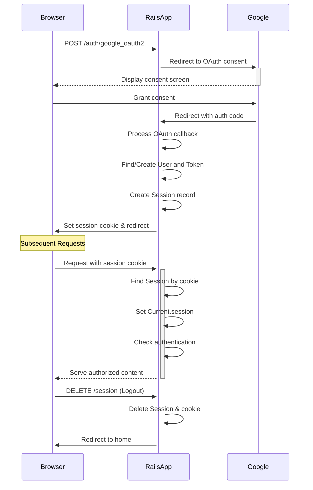

# 🔐 Authentication

This document outlines the authentication flow for GradeB🤖t.

## Strategy

We use Google OAuth 2.0 via the **[omniauth-google-oauth2](https://github.com/zquestz/omniauth-google-oauth2)** gem to authenticate users with their existing Google accounts.

## Key Components

* **OmniAuth Initializer**: Configures Google OAuth with environment variables, requests `email`, `profile`, and `drive.file` scopes with offline access.

* **Routes**:
  * `POST /auth/google_oauth2`: Initiates the OAuth flow
  * `GET /auth/:provider/callback`: Handles OAuth callback
  * `GET /auth/failure`: Redirects on authentication failure
  * `resource :session`: Provides login/logout endpoints

* **Models**:
  * `User`: Stores `email`, `name`, `google_uid`, `profile_picture_url`, and `admin` flag
  * `UserToken`: Stores Google OAuth credentials with expiration checking
  * `Session`: Records login sessions with `user_agent` and `ip_address` for auditing
  * `Current`: Thread-local storage that delegates `user` to the current session

* **Authorization::UserService**: Manages user creation/updates from Google auth data, creating `UserToken` records to store credentials.

* **SessionsController**:
  * `create`: Processes OAuth callback, creates user session and cookie
  * `destroy`: Ends user session and removes cookie

* **Authentication Concern**:
  * Added to `ApplicationController`
  * `require_authentication`: Main before_action that calls `resume_session` and redirects if no valid session exists
  * `allow_unauthenticated_access`: Skips authentication check for specific actions
  * `authenticated?`: Helper method for views to check login status
  * `resume_session`: Finds session by cookie and populates `Current.session`

## Authentication Flow

## Session Management

1. **Login**: After Google authentication, we create a `Session` record and set a signed, permanent `session_id` cookie.

2. **Session Resumption**: On each request, `require_authentication` calls `resume_session`, which:
   * Reads the `session_id` cookie
   * Finds the corresponding `Session` record
   * Sets `Current.session` for access throughout the request

3. **Authentication Check**: For protected routes, we verify `Current.session` exists, redirecting to login if not. Routes marked with `allow_unauthenticated_access` skip this check.

4. **Current User Access**: Throughout the app, `Current.user` provides access to the authenticated user via `Current.session.user`. Views use `authenticated?` to conditionally render content.

5. **Logout**: The "Sign out" link triggers `SessionsController#destroy`, which deletes both the `Session` record and cookie.