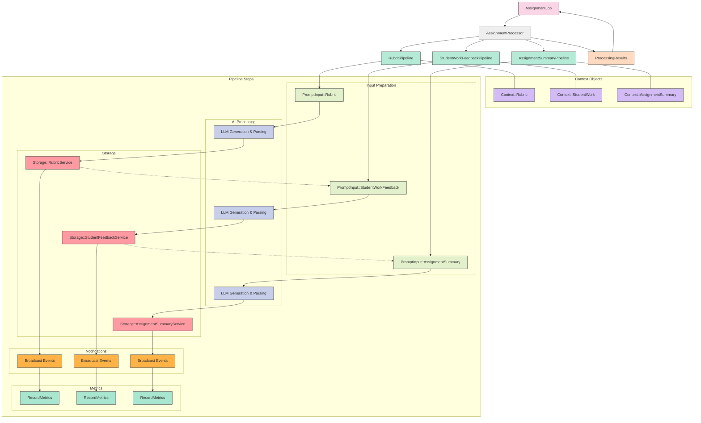

# Pipeline Architecture Implementation Plan

## Overview

This document outlines the plan to update GradeBot's architecture to implement a more structured pipeline-based approach for processing assignments. The new architecture will replace the current `ProcessingTask` implementation with a cleaner, more modular pipeline system as outlined in the `brainstorm.md` document.

## Current vs. New Architecture

### Current Architecture (to be replaced)

The current architecture uses a `ProcessingTask` class with various process types for handling different aspects of assignment processing. This approach has several limitations:
- Less explicit flow of data between processing steps
- Harder to track state changes during processing
- Limited modularity for testing individual components
- More complex error handling

### New Pipeline Architecture

The new pipeline architecture introduces:
- Clear, single-responsibility pipeline classes for each major process (Rubric, StudentWorkFeedback, AssignmentSummary)
- Explicit step composition with clearer data flow
- Context objects that maintain state throughout the pipeline
- Dedicated broadcast events for real-time updates
- Cleaner error handling and result aggregation
- More testable components with clear interfaces

## System Architecture Diagram

### Architecture Diagram Explanation

The diagram illustrates the pipeline architecture using a phase-based approach:

1. **Core Flow**: AssignmentJob initiates the AssignmentProcessor, which orchestrates the three main pipelines in sequence.

2. **Context Objects**: Each pipeline uses its own context object to maintain state throughout execution. These context objects store all intermediate data and results.

3. **Pipeline Phases**: Each pipeline follows the same 5-phase process:
   - **Phase 1**: Input preparation - Gathering and formatting data for LLM processing
   - **Phase 2**: AI processing - Generating content via LLM and parsing responses
   - **Phase 3**: Storage - Persisting processed data to the database
   - **Phase 4**: Notifications - Broadcasting progress events to clients
   - **Phase 5**: Metrics - Recording performance and usage metrics

4. **Dependencies**: The diagram shows critical cross-pipeline dependencies:
   - Student feedback generation depends on the completed rubric
   - Assignment summary generation depends on completed student feedback

5. **Results Aggregation**: All pipeline results are collected by the AssignmentProcessor into a unified ProcessingResults object, which is then used by the AssignmentJob for final logging and reporting.

## File Structure and Class Names

### Core Pipeline Components

| Class Name | File Path | Description | Public Methods |
|------------|------------|-------------|---------------|
| `AssignmentProcessor` | `app/services/assignment_processor.rb` | Main entry point for processing an assignment with all its student works. Orchestrates the execution of individual pipelines and aggregates results. | **Class**: None **Instance**: `initialize(assignment)`, `process` |
| `ProcessingResult` | `app/services/processing_result.rb` | Represents the result of a single pipeline execution, encapsulating success status, data, errors, and metrics. | **Class**: None **Instance**: `initialize(success:, data:, errors:, metrics:)`, `success?`, `error?` |
| `ProcessingResults` | `app/services/processing_results.rb` | Aggregates multiple processing results from different pipelines into a cohesive structure. | **Class**: None **Instance**: `initialize(rubric:, student_feedbacks:, summary:, metrics:)`, `success?`, `to_h` |

### Context Objects

| Class Name | File Path | Description | Public Methods |
|------------|------------|-------------|---------------|
| `Pipeline::Context::Base` | `app/models/pipeline/context/base.rb` | Base class for all pipeline context objects providing common functionality and interfaces. | **Class**: None **Instance**: `initialize`, `add_metric(key, value)`, `record_timing(operation, &block)` |
| `Pipeline::Context::Rubric` | `app/models/pipeline/context/rubric.rb` | Maintains state during rubric generation, including assignment data, prompts, LLM responses, and results. | **Class**: None **Instance**: `initialize(assignment:, user:)`, accessors for all attributes |
| `Pipeline::Context::StudentWork` | `app/models/pipeline/context/student_work.rb` | Maintains state during student work feedback generation, including student work data, rubric, prompts, and results. | **Class**: None **Instance**: `initialize(student_work:, rubric:, user:)`, accessors for all attributes |
| `Pipeline::Context::AssignmentSummary` | `app/models/pipeline/context/assignment_summary.rb` | Maintains state during assignment summary generation, including all student feedbacks and aggregate insights. | **Class**: None **Instance**: `initialize(assignment:, student_feedbacks:, user:)`, accessors for all attributes |

### Pipeline Classes

| Class Name | File Path | Description | Public Methods |
|------------|------------|-------------|---------------|
| `RubricPipeline` | `app/services/rubric_pipeline.rb` | Coordinates the generation of a structured rubric from assignment instructions, executing all necessary steps in sequence. | **Class**: `call(assignment:, user:)` **Instance**: None |
| `StudentWorkFeedbackPipeline` | `app/services/student_work_feedback_pipeline.rb` | Processes a single student's work against the rubric to generate detailed feedback, executing all necessary steps in sequence. | **Class**: `call(student_work:, rubric:, user:)` **Instance**: None |
| `AssignmentSummaryPipeline` | `app/services/assignment_summary_pipeline.rb` | Analyzes all student feedback to generate class-wide insights and recommendations, executing all necessary steps in sequence. | **Class**: `call(assignment:, student_feedbacks:, user:)` **Instance**: None |

### Prompt Input Services

| Class Name | File Path | Description | Public Methods |
|------------|------------|-------------|---------------|
| `PromptInput::Base` | `app/services/prompt_input/base.rb` | Base class for all prompt input services providing common templating and transformation methods. | **Class**: None **Instance**: `initialize`, `to_prompt`, `render_template(template_name, variables)` |
| `PromptInput::Rubric` | `app/services/prompt_input/rubric.rb` | Prepares input data for rubric generation prompts, extracting relevant information from assignments. | **Class**: `from(context:)` **Instance**: `initialize(assignment:, user:)`, `to_prompt` |
| `PromptInput::StudentWorkFeedback` | `app/services/prompt_input/student_work_feedback.rb` | Prepares input data for student feedback generation, combining student work content with rubric criteria. | **Class**: `from(context:)` **Instance**: `initialize(student_work:, rubric:, user:)`, `to_prompt` |
| `PromptInput::AssignmentSummary` | `app/services/prompt_input/assignment_summary.rb` | Prepares input data for assignment summary generation, aggregating student feedback patterns for class-wide insights. | **Class**: `from(context:)` **Instance**: `initialize(assignment:, student_feedbacks:, user:)`, `to_prompt` |

### LLM Services

| Class Name | File Path | Description | Public Methods |
|------------|------------|-------------|---------------|
| `LLM::ClientFactory` | `app/services/llm/client_factory.rb` | Factory for creating appropriate LLM clients based on the task type and configuration settings. | **Class**: `for_rubric_generation`, `for_student_feedback`, `for_assignment_summary` **Instance**: None |
| `LLM::Rubric::Generator` | `app/services/llm/rubric/generator.rb` | Handles the LLM interaction for generating rubrics, including prompt submission and response handling. | **Class**: `call(context:)` **Instance**: None |
| `LLM::Rubric::ResponseParser` | `app/services/llm/rubric/response_parser.rb` | Parses and structures raw LLM responses into usable rubric data with criteria and levels. | **Class**: `call(context:)` **Instance**: None |
| `LLM::StudentWorkFeedback::Generator` | `app/services/llm/student_work_feedback/generator.rb` | Handles the LLM interaction for generating student feedback, including prompt submission and response handling. | **Class**: `call(context:)` **Instance**: None |
| `LLM::StudentWorkFeedback::ResponseParser` | `app/services/llm/student_work_feedback/response_parser.rb` | Parses and structures raw LLM responses into usable feedback data with strengths, areas for improvement, and criterion-level assessments. | **Class**: `call(context:)` **Instance**: None |
| `LLM::AssignmentFeedback::Generator` | `app/services/llm/assignment_feedback/generator.rb` | Handles the LLM interaction for generating assignment summaries, including prompt submission and response handling. | **Class**: `call(context:)` **Instance**: None |
| `LLM::AssignmentFeedback::ResponseParser` | `app/services/llm/assignment_feedback/response_parser.rb` | Parses and structures raw LLM responses into usable summary data with class-wide insights and trends. | **Class**: `call(context:)` **Instance**: None |

### Storage Services

| Class Name | File Path | Description | Public Methods |
|------------|------------|-------------|---------------|
| `Pipeline::Storage::RubricService` | `app/services/pipeline/storage/rubric_service.rb` | Persists generated rubric data to the database, creating necessary models and associations. | **Class**: `call(context:)` **Instance**: None |
| `Pipeline::Storage::StudentFeedbackService` | `app/services/pipeline/storage/student_feedback_service.rb` | Persists generated student feedback data to the database, creating necessary models and associations. | **Class**: `call(context:)` **Instance**: None |
| `Pipeline::Storage::AssignmentSummaryService` | `app/services/pipeline/storage/assignment_summary_service.rb` | Persists generated assignment summary data to the database, creating necessary models and associations. | **Class**: `call(context:)` **Instance**: None |

### Support Services

| Class Name | File Path | Description | Public Methods |
|------------|------------|-------------|---------------|
| `Broadcast` | `app/services/broadcast.rb` | Provides real-time updates to clients about pipeline progress using ActionCable. | **Class**: `call(context:, event:)`, `rubric_started(context:)`, `rubric_completed(context:)`, `feedback_started(context:)`, `feedback_completed(context:)`, `summary_started(context:)`, `summary_completed(context:)` **Instance**: None |
| `RecordMetrics` | `app/services/record_metrics.rb` | Records performance metrics and usage statistics for monitoring and billing purposes. | **Class**: `call(context:)`, `record_llm_usage(context:, tokens:, model:, cost:)` **Instance**: None |

## Detailed Task Planning

### Updated Task List

Below are the detailed tasks required to implement the pipeline architecture. Each task is designed to be completed in approximately 1 hour or less.

| Task ID | Title | Description | Dependencies | Complexity | Status |
|---------|-------|-------------|--------------|------------|--------|
| P1 | Create decision log entry | Document the architectural shift in `docs/decision_log.md` | None | Low | Pending |
| P2 | Update plan.md | Replace the processing pipeline section with new architecture | P1 | Low | Pending |
| P3 | Create base context object | Implement `Pipeline::Context::Base` class | None | Low | Pending |
| P4 | Create rubric context | Implement `Pipeline::Context::Rubric` class | P3 | Low | Pending |
| P5 | Create student work context | Implement `Pipeline::Context::StudentWork` class | P3 | Low | Pending |
| P6 | Create assignment summary context | Implement `Pipeline::Context::AssignmentSummary` class | P3 | Low | Pending |
| P7 | Create processing result class | Implement `ProcessingResult` for pipeline results | None | Low | Pending |
| P8 | Create processing results class | Implement `ProcessingResults` for aggregated results | P7 | Low | Pending |
| P9 | Create broadcast service | Implement `Broadcast` service for real-time updates | None | Low | Pending |
| P10 | Create metrics service | Implement `RecordMetrics` service | None | Low | Pending |
| P11 | Create base prompt input | Implement `PromptInput::Base` class | None | Low | Pending |
| P12 | Create rubric prompt input | Implement `PromptInput::Rubric` class | P11 | Medium | Pending |
| P13 | Create student work prompt input | Implement `PromptInput::StudentWorkFeedback` class | P11 | Medium | Pending |
| P14 | Create assignment summary prompt input | Implement `PromptInput::AssignmentSummary` class | P11 | Medium | Pending |
| P15 | Create LLM client factory | Implement `LLM::ClientFactory` service | None | Medium | Pending |
| P16 | Create rubric generator | Implement `LLM::Rubric::Generator` class | P15 | Medium | Pending |
| P17 | Create rubric response parser | Implement `LLM::Rubric::ResponseParser` class | None | Medium | Pending |
| P18 | Create student work generator | Implement `LLM::StudentWorkFeedback::Generator` class | P15 | Medium | Pending |
| P19 | Create student work response parser | Implement `LLM::StudentWorkFeedback::ResponseParser` class | None | Medium | Pending |
| P20 | Create assignment feedback generator | Implement `LLM::AssignmentFeedback::Generator` class | P15 | Medium | Pending |
| P21 | Create assignment feedback parser | Implement `LLM::AssignmentFeedback::ResponseParser` class | None | Medium | Pending |
| P22 | Create rubric storage service | Implement `Pipeline::Storage::RubricService` class | None | Medium | Pending |
| P23 | Create student feedback storage service | Implement `Pipeline::Storage::StudentFeedbackService` class | None | Medium | Pending |
| P24 | Create assignment summary storage service | Implement `Pipeline::Storage::AssignmentSummaryService` class | None | Medium | Pending |
| P25 | Create rubric pipeline | Implement `RubricPipeline` class | P4, P7, P9, P10, P12, P16, P17, P22 | High | Pending |
| P26 | Create student work feedback pipeline | Implement `StudentWorkFeedbackPipeline` class | P5, P7, P9, P10, P13, P18, P19, P23 | High | Pending |
| P27 | Create assignment summary pipeline | Implement `AssignmentSummaryPipeline` class | P6, P7, P9, P10, P14, P20, P21, P24 | High | Pending |
| P28 | Create assignment processor | Implement `AssignmentProcessor` class | P8, P25, P26, P27 | High | Pending |
| P29 | Update assignment job | Modify `AssignmentJob` to use new processor | P28 | Medium | Pending |
| P30 | Create unit tests for context objects | Test all context classes | P4, P5, P6 | Medium | Pending |
| P31 | Create unit tests for pipelines | Test all pipeline classes | P25, P26, P27 | High | Pending |
| P32 | Create integration tests | Test complete processing flow | P28, P29 | High | Pending |
| P33 | Update relevant controllers | Update controllers that interact with processing | P29 | Medium | Pending |
| P34 | Update relevant views | Update views to work with new data structures | P33 | Medium | Pending |
| P35 | Perform end-to-end testing | Test complete user flow with new architecture | P33, P34 | High | Pending |

### Implementation Order

The optimal implementation order is as follows:

1. **Foundation (P1-P10)**: Start with documentation updates and core supporting classes
2. **Input Layer (P11-P14)**: Build the prompt input services
3. **LLM Layer (P15-P21)**: Implement LLM interaction services
4. **Storage Layer (P22-P24)**: Create storage services
5. **Pipeline Integration (P25-P28)**: Assemble the pipelines and processor
6. **System Integration (P29, P33-P34)**: Connect to existing components
7. **Testing (P30-P32, P35)**: Create comprehensive tests

## Implementation Tasks

### 1. Documentation Updates

1. **Update plan.md**:
   - Replace the current processing pipeline description with the new architecture
   - Keep all other sections of the plan intact
   - Ensure consistent terminology throughout the document

2. **Add Decision Log Entry**:
   - Document the architectural shift in `docs/decision_log.md`
   - Include rationale for the change
   - Note expected benefits and potential risks

### 2. Remove Outdated Implementation

1. **Identify Existing Code to Remove**:
   - `ProcessingTask` class and related components
   - Any existing task-based processors that will be replaced
   - Current processing job implementations that don't align with the new architecture

2. **Create Migration Path**:
   - Plan for graceful deprecation of existing components
   - Ensure in-progress assignments aren't affected during transition

### 3. Implement New Pipeline Components

1. **Core Pipeline Framework**:
   - Pipeline context classes for maintaining state
   - Base pipeline class structure
   - Result objects for standardized return values

2. **Individual Pipelines**:
   - `RubricPipeline`
   - `StudentWorkFeedbackPipeline`
   - `AssignmentSummaryPipeline`

3. **Pipeline Steps**:
   - Prompt input preparation services
   - LLM interaction services
   - Response parsing services
   - Storage services
   - Broadcast services
   - Metrics recording services

4. **Context Objects**:
   - Context classes for each pipeline type
   - Attribute accessors for state management

### 4. Integrate with Existing Components

1. **Update Background Jobs**:
   - Modify `AssignmentJob` to use the new processor
   - Ensure proper error handling and reporting

2. **Update Controllers**:
   - Modify any controllers that interact with the processing system
   - Update progress tracking and status reporting

3. **Update Views**:
   - Ensure views are compatible with the new data structures
   - Update any real-time updates using the new broadcast events

### 5. Update Task List

1. **Modify Existing Tasks**:
   - Update descriptions and details for tasks related to processing
   - Mark any obsolete tasks as cancelled

2. **Add New Tasks**:
   - Create new tasks for implementing pipeline components
   - Add tasks for testing and validation
   - Include tasks for updating documentation

## Task Dependencies

The following tasks in the current task list will need to be updated or replaced:

1. Tasks related to the existing `ProcessingTask` class
2. Tasks related to the current processor implementations
3. Tasks for background jobs that use the current processing approach

## Testing Strategy

1. **Unit Tests**:
   - Test each pipeline step in isolation
   - Test context objects and state management
   - Test result objects and error handling

2. **Integration Tests**:
   - Test complete pipelines with mock LLM responses
   - Test interaction between pipelines
   - Test error propagation and recovery

3. **System Tests**:
   - End-to-end tests for the entire assignment processing flow
   - Performance tests comparing old and new implementations

## Risks and Mitigations

1. **Risk**: Disruption to existing functionality during transition
   - **Mitigation**: Implement changes incrementally with thorough testing

2. **Risk**: Performance impact of new architecture
   - **Mitigation**: Benchmark key operations, optimize if needed

3. **Risk**: Increased complexity with more classes
   - **Mitigation**: Clear documentation, consistent naming conventions

## Implementation Timeline

1. Documentation updates and planning (1 day)
2. Core pipeline framework implementation (2 days)
3. Individual pipeline implementations (3 days)
4. Integration with existing components (2 days)
5. Testing and refinement (2 days)

## Conclusion

This architectural change will significantly improve the maintainability, testability, and clarity of the assignment processing system. The explicit pipeline approach provides better visibility into the processing flow and makes it easier to understand and modify individual components.

The transition should be managed carefully to ensure existing functionality is preserved while the new architecture is implemented.
